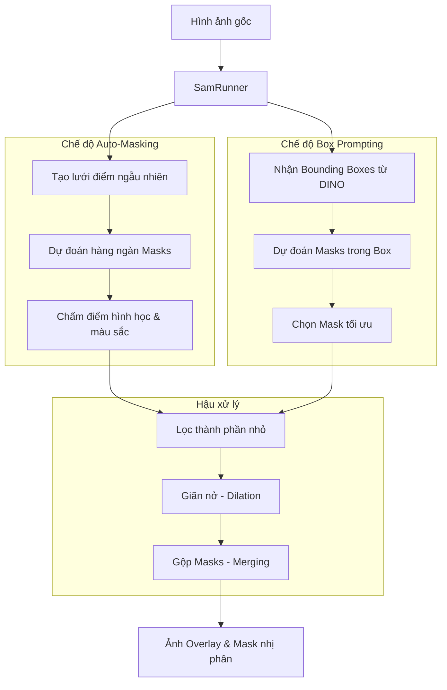

# Kiến trúc Chi tiết Mô hình SAM (Segment Anything)

Tài liệu này đi sâu vào cách dự án `DamageDetector` sử dụng mô hình Segment Anything Model (SAM) từ Meta, cũng như các thuật toán tùy chỉnh được bổ sung để đánh giá và trích xuất đặc trưng của vết nứt.

## 1. Tổng quan Hệ thống
Module `sam` nhận hình ảnh (hoặc tọa độ từ DINO) và xuất ra các lớp mặt nạ nhị phân (Binary Masks) mô tả hình dáng chính xác của đối tượng. 
Dự án sử dụng thư viện `segment_anything` tiêu chuẩn, hỗ trợ ba phiên bản ViT (Vision Transformer):
- `vit_b` (Base): Nhanh nhất, yêu cầu ít VRAM.
- `vit_l` (Large): Cân bằng.
- `vit_h` (Huge): Chính xác nhất, yêu cầu nhiều VRAM nhất.

Lớp `SamRunner` đảm bảo việc quản lý tài nguyên và tự động fallback thiết bị (MPS -> CUDA -> CPU) dựa trên hàm `select_device_str`.

### Sơ đồ Luồng xử lý (Pipeline)

## 2. Chế độ Tự động Phân vùng (Auto-Masking)

Hàm `_process_one_image_sam_only` kích hoạt chế độ "Everything". SAM tự động rải một mạng lưới các điểm (points) đều khắp ảnh và sinh ra hàng ngàn masks. 

### Cấu hình Hiệu suất (Profiles)
Tùy thuộc vào thiết bị hoặc tham số `sam_auto_profile`, hệ thống sử dụng bộ tham số được tinh chỉnh sẵn:
- **FAST** (Thường cho MPS/Mac): Lưới điểm thưa (`points_per_side=32`), giảm số lớp cắt (`crop_n_layers=0`).
- **QUALITY** (Thường cho CPU): Lưới trung bình (`points_per_side=48`).
- **ULTRA** (Thường cho CUDA): Lưới dày đặc (`points_per_side=64`), nhiều lớp cắt nhỏ (`crop_n_layers=1`), giúp tìm ra cả những vết nứt mảnh nhất nhưng tốn rất nhiều thời gian tính toán.

### Thuật toán Lọc và Chấm điểm Vết nứt (Crack Scoring Algorithm)
Khác với các đối tượng thông thường, vết nứt có hình dạng đặc thù (mỏng, dài, tối màu). Dự án đã phát triển một hệ thống chấm điểm (`score_mask_for_crack` và `_mask_stats`) thay vì chỉ dùng `predicted_iou` của SAM:
1. **Phân tích Hình học (`_mask_stats`)**:
   - `image_ratio`: Tỷ lệ diện tích mask so với ảnh. (Vết nứt không thể quá lớn).
   - `fill_ratio`: Diện tích mask chia cho diện tích bounding box của chính nó. (Vết nứt có hình đường chéo nên `fill_ratio` rất thấp).
   - `elongation` & `thinness`: Độ thuôn dài và độ mỏng, được tính toán dựa trên thuật toán PCA/Skeletonization cục bộ.
2. **Phân tích Màu sắc (`score_mask_darkness`)**:
   - Vết nứt thường là khe hở, không bắt sáng nên sẽ có màu tối hơn vùng bê tông xung quanh.
   - Hàm này tính trung bình độ xám (grayscale) bên trong mask so với viền bao quanh mask. Sự chênh lệch càng lớn, `darkness_score` càng cao.
3. **Cơ chế Loại bỏ (Heuristic Rejection)**:
   - Loại nếu `image_ratio > 0.12` (Quá lớn, có thể là bóng râm).
   - Loại nếu `fill_ratio > 0.55` và `image_ratio > 0.02` (Hình dạng cục mập mạp).
   - Loại nếu `darkness_score < 3.0` (Không đủ độ tương phản để là vết nứt).
   - Giữ lại top 12 mask có tổng điểm `shape_score + 0.35 * darkness_score` cao nhất.

*Lưu ý: Nếu `task_group="more_damage"` (tìm cả nứt, rỗ, vỡ), hệ thống sẽ bỏ qua bộ lọc hình học khắt khe này và chỉ dùng điểm `predicted_iou`.*

## 3. Chế độ Prompt bằng Bounding Box (Box Prompting)

Đây là quy trình kết hợp (Pipeline) phổ biến nhất: **DINO -> SAM**.
Hàm `_segment_boxes_with_predictor`:
1. **Nhận Box**: Lấy danh sách tọa độ box `[x1, y1, x2, y2]`.
2. **Kẹp biên (Clipping)**: Giới hạn tọa độ không vượt quá kích thước ảnh để tránh lỗi tràn mảng.
3. **Dự đoán**: Chạy `predictor.predict(box=input_box, multimask_output=True)`. SAM sẽ trả về 3 mask dự đoán cho mỗi box.
4. **Lựa chọn Mask (`select_sam_mask`)**: 
   - Đánh giá 3 mask dựa trên độ thuôn dài và kích thước. Tham số `prefer_crack` sẽ ưu tiên mask mỏng, sắc nét nhất thay vì mask bao trọn toàn bộ box.

## 4. Khâu Hậu xử lý (Post-Processing)

Dù sinh ra từ Auto-mask hay Box Prompt, kết quả đều trải qua các bước tinh chỉnh:
- **`filter_small_components`**: Dùng thuật toán Connected Components của OpenCV (`cv2.connectedComponentsWithStats`) để xóa các hạt nhiễu có diện tích nhỏ hơn `sam_min_component_area`.
- **Dilation (`sam_dilate_iters`)**: Sử dụng hình thái học `cv2.dilate` với kernel Hình Elip (3x3). Vết nứt do SAM phân vùng đôi khi chỉ rộng 1-2 pixel, phép toán này làm mask "dày" lên để dễ quan sát hoặc đáp ứng yêu cầu đo đạc.
- **Invert Mask**: Cờ `--invert-mask` cho phép đảo ngược hệ số (1 thành 0, 0 thành 1).
- **Trộn Mask (Merging)**: Sử dụng toán tử `np.maximum` để gộp tất cả các vùng phát hiện thành một mảng numpy duy nhất.
- **Xuất dữ liệu**: Sinh ra ảnh mask đen trắng và ảnh Overlay (được hòa trộn alpha blending `overlay_alpha=0.45` qua hàm `overlay_mask`). Dữ liệu gửi về UI được mã hóa `base64` trực tiếp từ bộ nhớ.