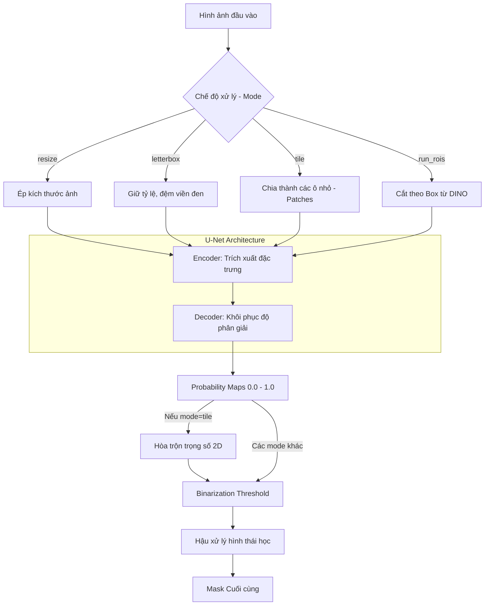

# Kiến trúc Chi tiết Mô hình U-Net

Tài liệu này phân tích kiến trúc mô hình U-Net (Semantic Segmentation) trong dự án `DamageDetector`, tập trung vào các chiến lược tiền xử lý ảnh và cơ chế Box Prompting mô phỏng.

## 1. Cấu trúc Mô hình (Model Architecture)
Module `unet` dựa trên kiến trúc Encoder-Decoder cổ điển:
- **Encoder**: Đóng vai trò trích xuất đặc trưng hình ảnh. Dự án hỗ trợ đa dạng các backbone từ thư viện `segmentation_models_pytorch` như họ `ResNet` (resnet34, resnet50), `EfficientNet`, v.v.
- **Decoder**: Khôi phục lại độ phân giải không gian từ các đặc trưng bậc cao, sử dụng các kết nối tắt (Skip Connections) để bảo toàn thông tin chi tiết của ảnh gốc.

### Trích xuất Siêu dữ liệu (Metadata)
Khi tải mô hình thông qua `UnetRunner.ensure_model_loaded`, hệ thống không chỉ load `state_dict` mà còn đọc tệp cấu hình huấn luyện (ví dụ `config.json` hoặc lưu kèm trong `.pth`):
- Xác định tự động `arch` (Unet, UnetPlusPlus) và `encoder_name`.
- Trích xuất cấu hình chuẩn hóa ảnh (`train_preprocess`, `val_preprocess`) để đảm bảo ảnh đưa vào khi suy luận có cùng dải giá trị (mean, std) với lúc huấn luyện.
- Xác định `input_size` mặc định của mô hình.

### Sơ đồ Luồng xử lý (Pipeline)

## 2. Chiến lược Xử lý Ảnh Lớn (Inference Modes)
Mô hình CNN dễ bị quá tải bộ nhớ (Out Of Memory) nếu nhận trực tiếp ảnh vài chục Megapixel. Lớp `predict_lib.core.predict_image` định tuyến xử lý ảnh qua 3 cơ chế (`mode`):

### A. Chế độ `resize` (Nhanh nhất, Kém chính xác nhất)
- Ảnh gốc được OpenCV ép kích thước trực tiếp về `input_size` x `input_size` (vd: 512x512).
- Khuyết điểm: Phá vỡ tỷ lệ khung hình (Aspect Ratio), các vết nứt nhỏ bị bóp nghẹt và biến mất hoàn toàn. Thường chỉ dùng để nháp (warmup) hoặc ảnh vốn đã vuông.

### B. Chế độ `letterbox` (Giữ tỷ lệ)
- Resize ảnh sao cho cạnh lớn nhất bằng `input_size`, cạnh còn lại được đệm (padding) bằng giá trị 0 (màu đen) để tạo thành ảnh vuông hoặc bội số của 32.
- Sau khi mô hình nhả kết quả dự đoán, vùng đệm được cắt bỏ và ảnh dự đoán được resize ngược về kích thước ban đầu. 
- Ưu điểm: Không méo ảnh. Khuyết điểm: Vẫn làm mất chi tiết nếu ảnh gốc cực lớn.

### C. Chế độ `tile` (Khuyên dùng cho ảnh công nghiệp)
Chiến lược chia để trị (Tiled Inference) tinh vi:
1. **Chia khối**: Hàm `tiled.py` cắt ảnh gốc thành các khối vuông `input_size`.
2. **Chồng lấn (Overlap)**: Độ chồng lấn được thiết lập qua `tile_overlap` (nếu bằng 0, tự động lấy `input_size // 2`).
3. **Batching**: Các khối được gộp thành các lô (batch) kích thước `tile_batch_size` để tận dụng khả năng tính toán song song của GPU.
4. **Hòa trộn 2D (2D Blending)**: Mảng xác suất (Probability Map) trả về được nhân với một Ma trận Trọng số (Weight Matrix - thường dốc ở giữa, thấp ở biên) và cộng dồn vào một mảng `accumulator` khổng lồ bằng kích thước ảnh gốc. Mảng đếm `weight_accumulator` giữ tổng trọng số để chuẩn hóa (chia trung bình) ở bước cuối.
5. Phương pháp này đảm bảo vết nứt chạy qua nhiều ô vẫn nối liền mạch, không sinh ra lỗi "kẻ sọc" ở biên.

## 3. Cơ chế Giả lập Box Prompting (`run_rois`)
Mặc dù U-Net thuần túy không nhận tham số Bounding Box (như SAM), dự án xây dựng hàm `UnetRunner.run_rois` để làm việc với pipeline **DINO -> U-Net**:

1. Nhận danh sách các `rois` (Region of Interests).
2. Khởi tạo một mặt nạ rỗng (Zero Mask) bằng kích thước ảnh gốc.
3. Với mỗi ROI `(x1, y1, x2, y2)`:
   - Cắt mảng NumPy hình ảnh (`rgb[y1:y2, x1:x2]`).
   - Đưa đoạn ảnh cắt này qua quy trình dự đoán của U-Net (vẫn hỗ trợ `tile` hoặc `resize` bên trong).
   - Resize ngược mask dự đoán cho vừa vặn chính xác với ROI.
   - Ghi đè vào mảng mặt nạ rỗng: `final_mask[y1:y2, x1:x2] = np.maximum(...)`.
4. Cơ chế này tăng tốc độ suy luận gấp nhiều lần vì U-Net không phải chạy trên các vùng nền không chứa khuyết tật.

## 4. Khâu Hậu xử lý (Post-Processing)
Được quản lý trong `predict_lib.postprocess`:
- **Binarization**: Hàm `binarize_prediction` biến mảng xác suất (0.0 -> 1.0) thành nhị phân (True/False) dựa trên tham số `--threshold` (mặc định 0.5).
- **Làm sạch (`postprocess_binary_mask`)**: Nếu không có cờ `--no-postprocessing`, hệ thống áp dụng các phép hình thái học học lọc nhiễu diện tích nhỏ, lấp đầy lỗ hổng (hole filling) để cho ra mask mịn màng nhất.